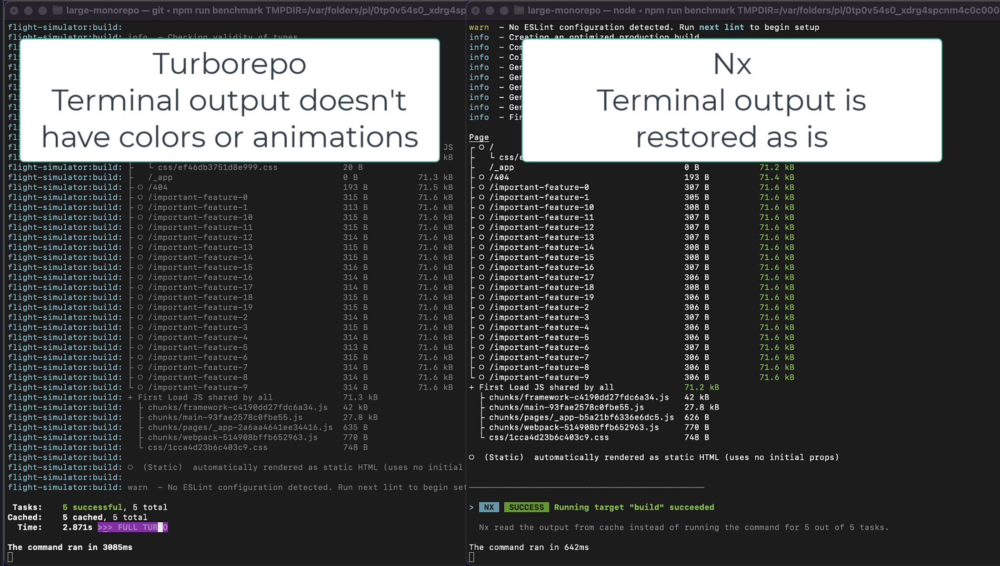

# Benchmarking Nx and Turbo

Recording:

Repo contains:

1. 5 shared buildable packages/libraries with 250 components each
2. 5 Next.js applications built out of 20 app-specific libraries. Each app-specific lib has 250 components each. Each library uses the shared components.

Combined there are about 26k components. It's a lot of components, but they are very small. This corresponds to a medium size enterprise repo. A lot of our clients have repos that are 10x bigger than this, so this repo isn't something out or ordinary. And, the bigger the repo, the bigger the difference in performance between Nx and Turbo.

The repo has both Nx and Turbo enabled. They don't affect each other. You can remove one without affecting the other one.

## Benchmarking it

Run `npm run benchmark`. The benchmark will warm the cache of both Turbo and Nx. We benchmark how quickly Turbo/Nx can figure out what needs to be restored from the cache and restores it.

These are the numbers using the latest MBP machine:
- average turbo time is: 3113.6
- average nx time is: 592.62
- nx is 5.253957004488543 faster

These are the numbers using a Windows laptop:

### Why is Nx faster

Nx is in many ways akin to React in that it's doing tree diffing when restoring files from the cache. If the right files are in the right place, Nx won't touch them. Turbo blows everything away every time. Nx's version isn't just faster, it's also more useful (again similarly to tree diffing in React). Blowing everything away on every restoration means that if any tools watch the folders (which is common when you build large apps or build microfrontends), they are going to get confused or triggered for no reason. This is similar to  how recreating the DOM from scratch isn't just slower, but results in worse UX.

If you remove the folders before every invocation (Nx will have to recreate all the folders the same way, so its smartness doesn't help it), Nx is still 1.5 times faster.

Is Nx always faster? No. Nx uses Node.js, so it takes about 150ms to boot, regardless of what you do. You build 1000 projects, takes 150ms. You build 1 project, it takes 150ms. If you have a repo with say 10 files in it, running Turbo will likely be faster because it boots faster.

Yarn, npm, pnpm have a similar boot time to Nx, and folks don't mind. And, of course, it's worth asking whether a high-performance build tool is even required for a repo with 10 files in it.

### Does this performance difference matter in practice?

The cache restoration Turborepo provides might be fast enough for a lot of repos (3 seconds is still plenty fast). What matters for larger repos like this one is the ability to distribute any command across say 50 machines while preserving the dev ergonomics of running it on a single machine. Nx can do it. Bazel can do it (which Nx borrows some ideas from). Turbo can't. This is where the perf gains are for larger repos.

## Dev ergonomics & Staying out of your way

When some folks compare Nx and Turborepo, they say something like "Nx may do all of those things well, and may be faster, but Turbo is built to stay out of you way". Let's talk about staying out of your way:

Run `npx turbo run build --scope=crew --force` and then run `npx nx build crew --skip-nx-cache`:

Nx doesn't change your terminal output. Spinners, animations, colors are the same whether you use Nx or not (we instrument Node.js to get this result). What is also important is that when you restore things from cache, Nx will replay the terminal output identical to the one you would have had you run the command.

Examine Turbo's output: no spinners, no animations, no colors. It's Travis CI circa 2000. Pretty much anything you run with Turbo looks different (and a lot worse, to be honest) from running the same command without Turbo.

A lot of Nx users don't even know they use Nx, or even what Nx is. Things they run look the same, they just got faster.

## Found an issue? Send a PR.

If you find any issue with the repo, with the benchmark or the setup, please send a PR. 
